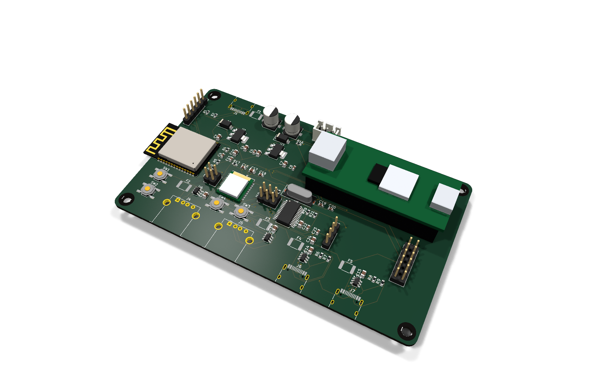
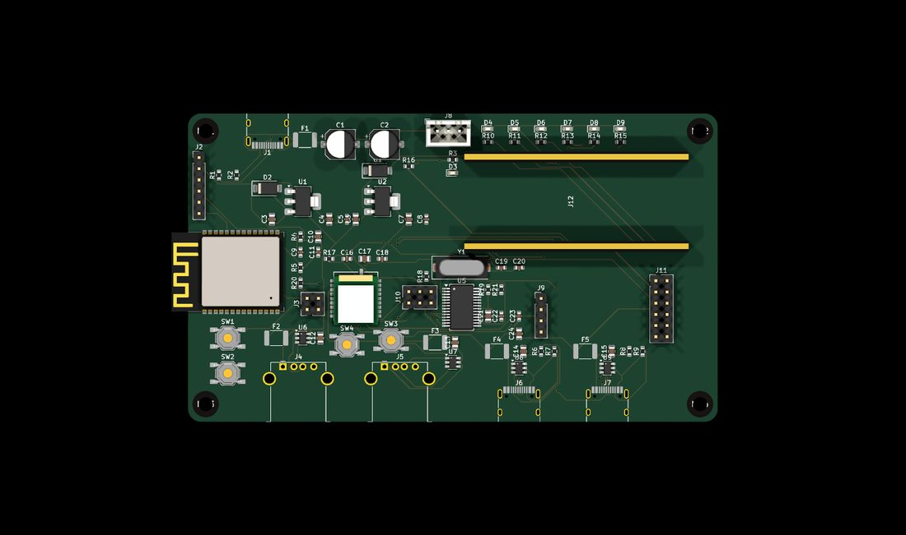
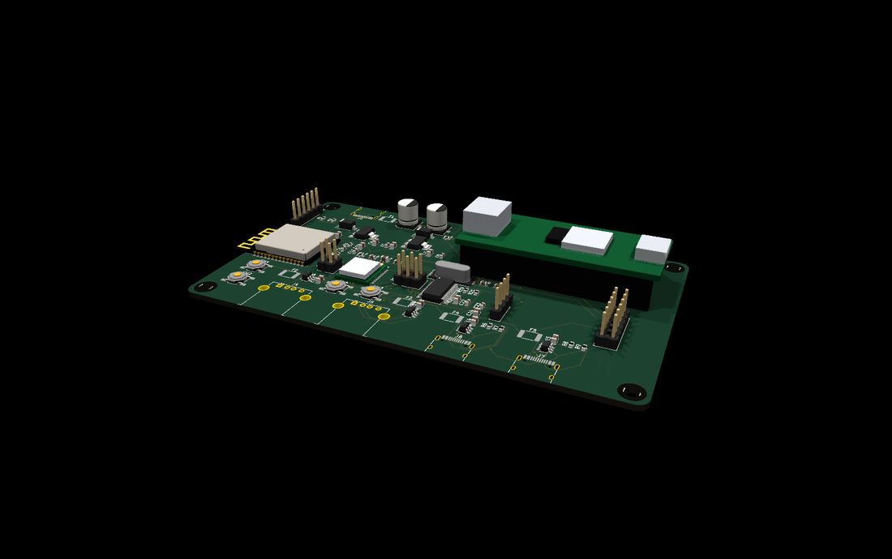
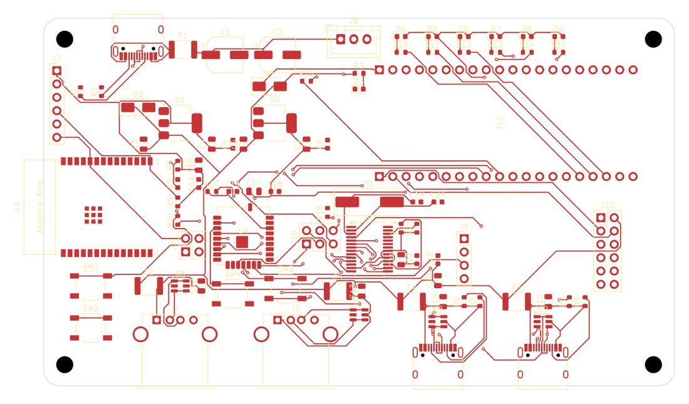
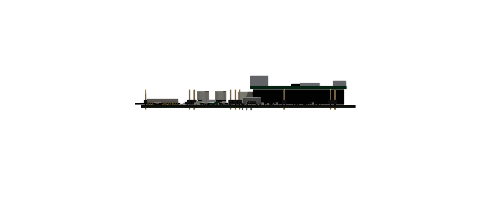

# dock20k

Carrier / dock board for the **Tang Nano 20K** running the **MSXnano** core.
Placa portadora ("dock") para el **Tang Nano 20K** con el core **MSXnano**.

📖 See [`CONNECTORS.md`](CONNECTORS.md) for the full connector/jumper reference · [`../README.html`](../README.html) for the illustrated bilingual overview.



### Views / Vistas

| | |
|:---:|:---:|
|  |  |
| *Top-down 3D · Cenital 3D* | *Tang on socket · Tang en zócalo* |
|  |  |
| *Top copper routing (KiCad) · Rutado cobre superior* | *Front elevation of the stack · Alzado del stack* |

Full-res: [`render_top.png`](render_top.png) · [`render_iso_ports.png`](render_iso_ports.png) · [`render_dock.png`](render_dock.png) · [`layout_top.png`](layout_top.png) · [`layout_bottom.png`](layout_bottom.png) · PDFs: [schematic](msxnano_dock_schematic.pdf) · [PCB top](msxnano_dock_pcb_top.pdf) / [bottom](msxnano_dock_pcb_bottom.pdf)

```
USB-C 5V ──fuse 2A──► +5V ──SS34──► Tang 5V pin (J5.1)
                       ├──► AMS1117-3.3 #1 ──► ESP32-C6
                       ├──► AMS1117-3.3 #2 ──► M0S / BL616
                       └──► FE1.1s hub + 4 ports (500 mA polyfuse each)

Tang (2x20 socket) ──SPI 42/41/56/54/51──► M0S BL616 ──USB──► FE1.1s hub ──► 2×USB-A + 2×USB-C
                   ──UART 27/28──► ESP32-C6 UART0 @ 859372 bps
                   ──pin 25──► WS2812   ──pins 15-20──► status LEDs   ──pin 26──► ESP reset (R20 0Ω)
```

## EN — Design notes

- **BL616 = bare Sipeed M0S module** (soldered). Runs the stock FPGA-Companion `M0S_DOCK` build — SPI on IO10–IO14 exactly like the dock, detected by the core via `m0s[2]`. No RTL changes. The M0S has **no on-board regulator** → dedicated 3.3 V LDO.
- **Hub = FE1.1s** (SSOP-28): 12 MHz crystal (load caps integrated), REXT 2.7 kΩ 1%, self-powered (BUSJ→3V3, **OVCJ→10k to 3V3, mandatory**, PWRJ NC). Note: the Rev 1.0 datasheet misprints DMU as pin 25 — it is **pin 15**.
- **WiFi = ESP32-C6-WROOM-1-N8** with ducasp's ESP32-UNAPI firmware. The core's WiFi UART is fixed at **859372 bps**; ducasp reports that rate is unreliable on the classic WROOM but fine on the C6 (the repo's default target). Needs **8 MB flash** → the -N8 part.
- **Rule:** everything goes through the Tang's two 2×20 headers — **no external cables.**

## ES — Notas de diseño

- **BL616 = módulo Sipeed M0S pelado** (soldado). Ejecuta el build `M0S_DOCK` de FPGA-Companion tal cual — SPI en IO10–IO14 igual que el dock, detectado por el core vía `m0s[2]`. Sin tocar RTL. El M0S **no lleva regulador** → LDO de 3.3 V dedicado.
- **Hub = FE1.1s** (SSOP-28): cristal 12 MHz (caps de carga integrados), REXT 2.7 kΩ 1%, self-powered (BUSJ→3V3, **OVCJ→10k a 3V3, obligatorio**, PWRJ sin conectar). Ojo: el datasheet Rev 1.0 imprime mal DMU como pin 25 — es el **pin 15**.
- **WiFi = ESP32-C6-WROOM-1-N8** con el firmware ESP32-UNAPI de ducasp. La UART del WiFi del core está fija a **859372 bps**; ducasp indica que esa velocidad es poco fiable en el WROOM clásico pero correcta en el C6 (target por defecto del repo). Necesita **8 MB de flash** → la variante -N8.
- **Regla:** todo pasa por los dos conectores 2×20 del Tang — **sin cables externos.**

## Status / Estado

- EN: Schematic complete (**ERC 0 errors**). 2-layer PCB, **routed 100%** with freerouting (**DRC 0 errors**), GND pours both sides, RF keepout under the ESP antenna. **Not fabricated yet** — verify the socket against a real Tang (rows 20.32 mm, pin-1 side) before ordering.
- ES: Esquemático completo (**ERC 0 errores**). PCB de 2 capas, **rutada al 100%** con freerouting (**DRC 0 errores**), planos de GND en ambas caras, keepout de RF bajo la antena del ESP. **Sin fabricar aún** — verifica el zócalo contra un Tang real (filas 20.32 mm, lado del pin 1) antes de encargarla.

## Files / Ficheros

`msxnano_dock.kicad_pro/.kicad_sch/.kicad_pcb` · `sym-lib-table` / `fp-lib-table` (paths via `${KIPRJMOD}`) · `libs/` (M0S + Espressif official symbols/footprints/3D, FE1.1s + Tang socket custom) · `msxnano_dock_schematic.pdf` · `msxnano_dock_pcb_top.pdf` / `_bottom.pdf` · `msxnano_dock_bom.csv` · `render_dock.png` / `render_assembled.png`

## Sources / Fuentes (verified 2026-07)

Tang Nano 20K official 3921 schematic + dimensions (dl.sipeed.com) · M0S module & dock schematics + official KiCad footprint · FE1.1s datasheet Rev B (DMU = pin 15) · ESP32-UNAPI source (UART0, baud, 8 MB, targets).
