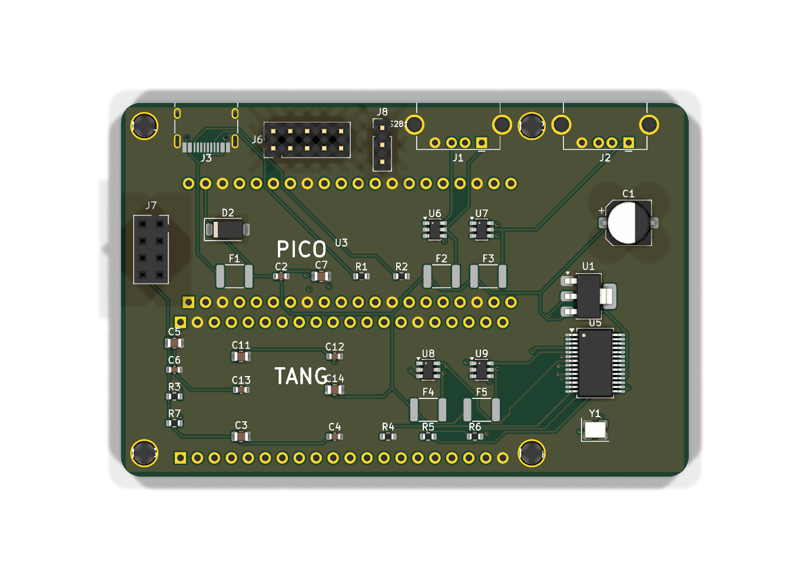
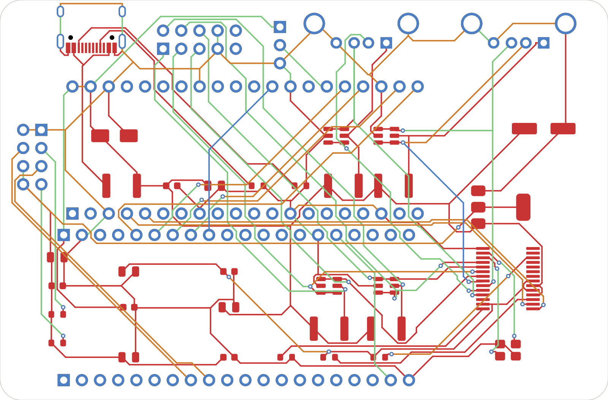

# rpi3-compatible

**MSXnano carrier in Raspberry Pi 3 form factor (85 × 56 mm), fully modular.**
**Placa portadora MSXnano con formato Raspberry Pi 3 (85 × 56 mm), totalmente modular.**

Instead of soldering the USB companion and WiFi chips (like [`../dock20k`](../dock20k/)), this board takes **plug-in modules**: a **Raspberry Pi Pico (RP2040)** as the USB-HID companion and an **ESP-01S** for WiFi — so there is nothing exotic to source or reflow, and the RPi3 outline drops into any Pi-3 case/mount.

En lugar de soldar los chips de companion USB y WiFi (como en [`../dock20k`](../dock20k/)), esta placa usa **módulos enchufables**: una **Raspberry Pi Pico (RP2040)** como companion USB-HID y un **ESP-01S** para WiFi — así no hay nada raro que abastecer ni soldar, y el contorno RPi3 encaja en cualquier caja/soporte de Pi 3.

### Views / Vistas

| | |
|:---:|:---:|
|  |  |
| *3D top (as placed) · 3D cenital (colocación real)* | *4-layer routing · Rutado 4 capas* |

PDFs: [schematic](board8020_schematic.pdf) · [PCB top](board8020_pcb_top.pdf) · 3D: [`board8020_rpi3.step`](board8020_rpi3.step)

```
USB-C 5V ──fuse 2A──► +5V ──► Tang 5V (socket) + Pico VSYS
                       ├──► AMS1117-3.3 ──► ESP-01S (WiFi)
                       └──► FE1.1s hub ──► 4 downstream ports (500 mA polyfuse each)

Tang (2x20 socket) ──SPI (M0S_* nets)──► RPi Pico (FPGA-Companion PICO build) ──USB host──► FE1.1s hub ──► 2×USB-A + USB2 header
                   ──UART 27/28──► ESP-01S UART @ 859372 bps
Pico GP20 ──► WS2812 header (J8, DIN)
```

## EN — Design notes

- **USB companion = plug-in Raspberry Pi Pico (RP2040)** on a 2×20 female socket, running the FPGA-Companion **`PICO`** build (PIO-USB host). Drives keyboard/mouse/joystick over the same SPI `m0s[]` path the core already detects — **no RTL changes**. Avoids the Tang `3921` BL616 secure-boot problem entirely (no on-board BL616 involved).
- **WiFi = ESP-01S** on a 2×4 female socket, on the core's WiFi UART @ **859372 bps** (its own 3.3 V LDO + pull-ups).
- **Hub = FE1.1s** (SSOP-28) with a **12 MHz SMD-3225 crystal** (JLC Basic C9002). Downstream: 2× USB-A on the rear edge + a **2×5 USB2 header** (2 more ports).
- **Form factor:** exact **Raspberry Pi 3** outline — 85 × 56 mm, 4 mounting holes on the RPi3 58 × 49 pattern. **4 copper layers.**
- **Header-only parts:** the USB2 header (J6), the ESP-01 socket (J7) and the **WS2812 3-pin header (J8)** are left as **plated holes** — solder your own. They are **excluded from the assembly BOM**.

## ES — Notas de diseño

- **Companion USB = Raspberry Pi Pico (RP2040) enchufable** en zócalo 2×20 hembra, con el build **`PICO`** de FPGA-Companion (host USB por PIO). Lleva teclado/ratón/joystick por la misma ruta SPI `m0s[]` que el core ya detecta — **sin tocar el RTL**. Evita por completo el problema del secure-boot del BL616 de los Tang `3921` (aquí no hay BL616).
- **WiFi = ESP-01S** en zócalo 2×4 hembra, en la UART de WiFi del core a **859372 bps** (con su LDO de 3.3 V y pull-ups).
- **Hub = FE1.1s** (SSOP-28) con **cristal 12 MHz SMD-3225** (JLC Basic C9002). Downstream: 2× USB-A en el borde trasero + un **header USB2 2×5** (2 puertos más).
- **Formato:** contorno exacto de **Raspberry Pi 3** — 85 × 56 mm, 4 anclajes en el patrón RPi3 58 × 49. **4 capas de cobre.**
- **Piezas solo-agujeros:** el header USB2 (J6), el zócalo del ESP-01 (J7) y el **header WS2812 de 3 pines (J8)** quedan como **agujeros metalizados** — los sueldas tú. Están **fuera del BOM de montaje**.

## Status / Estado

- EN: 85 × 56 mm **4-layer PCB, routed 100 %** with freerouting, GND planes on all 4 layers. **DRC: 0 unconnected, 0 electrical errors** (only cosmetic silk/library warnings). **JLCPCB fabrication package included** (gerbers + BOM + CPL). Component placement done by hand. **Not fabricated yet** — before ordering, verify the USB-A (J1/J2) and USB-C (J3) footprints/orientation and the Pico/Tang socket rows against physical modules.
- ES: PCB de **4 capas 85 × 56 mm, rutada al 100 %** con freerouting, planos de GND en las 4 capas. **DRC: 0 sin conectar, 0 errores eléctricos** (solo avisos cosméticos de serigrafía/librería). **Paquete de fabricación JLCPCB incluido** (gerbers + BOM + CPL). Colocación de componentes hecha a mano. **Sin fabricar aún** — antes de encargarla, verifica los footprints/orientación de los USB-A (J1/J2) y USB-C (J3) y las filas de los zócalos Pico/Tang contra los módulos físicos.

## Files / Ficheros

`msxnano-board8020.kicad_pro/.kicad_sch/.kicad_pcb` · `sym-lib-table` / `fp-lib-table` (paths via `${KIPRJMOD}`) · `libs/` (M0S + Espressif symbols/footprints/3D, FE1.1s + Tang/Pico sockets custom) · `board8020_schematic.pdf` · `board8020_pcb_top.pdf` · `board8020_rpi3.step` · **fab:** `board8020_gerbers.zip` · `board8020_BOM_jlcpcb.csv` · `board8020_CPL_jlcpcb.csv` (JLCPCB format, top side, rotation-corrected).

## Key parts / Piezas clave (JLCPCB LCSC)

FE1.1s hub `C9359` (SSOP-28) · AMS1117-3.3 `C6186` · USBLC6-2SC6 ESD `C2687116` ×4 · 12 MHz 3225 xtal `C9002` (Basic) · SMAJ5.0A TVS `C2925443` · USB-C `C165948` · USB-A horiz `C2345` ×2 · 10k `C98220` · 5.1k `C23186` · 2.7k `C13167` · PPTC 2A `C960026` / 500mA `C369168`. **Not assembled (holes only):** RPi Pico, Tang Nano 20K, ESP-01S socket, USB2 header, WS2812 header.
